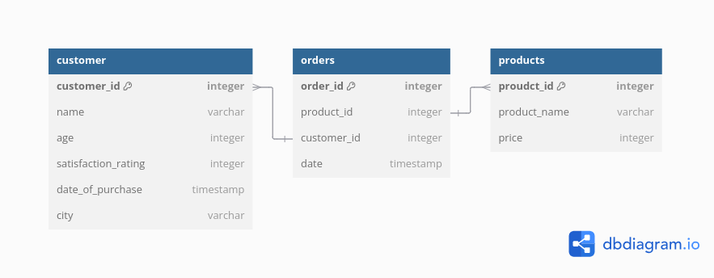
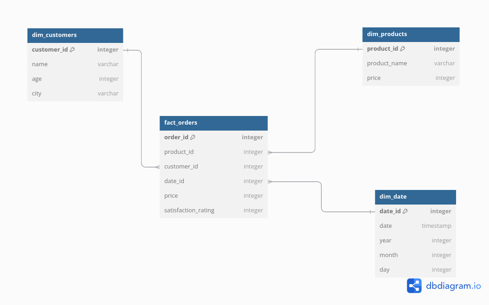

# End-to-end data pipeline

## Overview

This project starts with the data_creation.py file which randomly generates as many random customers, orders and products as desired. For the most part I am randomly generating 10,000 customers and 8 set products with a fixed price. Each customer has:

- A first name and last name
- Age
- Items bought (could be none)
- Satisfaction rating
- City they live in
- Date of purchase 

I am trying to replicate customer data as accurately as possible through this random generation. From this the json files are read and stored into a OLTP database with the structure below

### Extraction

There is then an extract.py file which extracts all the data out of the initial database and stores the information from the tables into their own csv files with relevant table names. 

### Transform

From here, I've written a transform.py file which transforms the csv files into the star schema for the OLAP database, shown below. The csvs are passed into dataframes where pandas manipulates them and does the relevant transformations.

### Load

I will then write a load.py function which will take the transformed data and load them into a OLAP database in the above star schema format so that data analysis can be performed on the data.

## Future improvements

This project is currently being run on a local machine with no orchestration and no updated customer information. Once I have developed the full pipeline in this local repo I will then create a free tier AWS account and host four AWS Lambda functions:

- Customer data creation
- Extraction of data
- Transforming of data
- Loading data

This will require s3 buckets for storage, cloudwatch logs, IAM policies, secretsmanager and two RDS databases. This will be predominately setup using terraform (IaC). 
